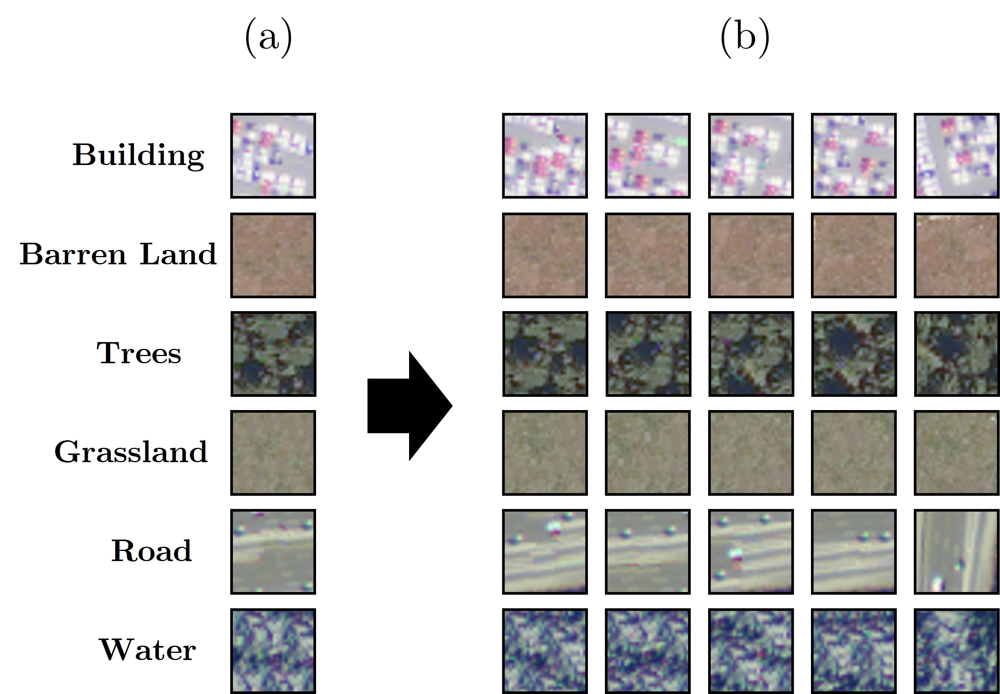

# Data-Augmentation for Remote Sensing Classification

This repository provides a comprehensive framework for evaluating the impact of various data augmentation strategies on remote sensing image classification. It compares the performance of multiple neural network architectures on two benchmark datasets: SAT-6 and UCMerced.

## Overview

We investigate the classification accuracy of the following neural network architectures:
- ResNet-50
- VGG-19
- Inception-v3
- Custom CNN

Each architecture is tested under three augmentation regimes:
1. **No Augmentation**: Baseline training on original images.
2. **Generic Augmentation**: Standard techniques such as cropping, rotation, and flipping.
3. **Cross-Correlation-Based Simulation (CCSIM)**: Advanced augmentation using cross-correlation-based texture synthesis ([Tahmasebi et al., 2012](https://link.springer.com/article/10.1007/s10596-012-9287-1)), implemented in MATLAB.

## Datasets

- **SAT-6**: Included in the repository under `SAT-6/DATA`.
- **UCMerced**: Download link provided in `UCMerced/data_link.txt`.

## Folder Structure

    ├── Paper.pdf
    ├── README.md
    ├── figures/                      # Figures for docs
    │   └── augmentation.jpg
    ├── SAT-6/                        # SAT-6 dataset + training
    │   ├── models/                   # Python: ResNet-50, VGG-19, Inception-v3, Simple CNN
    │   ├── data/                     # SAT-6 data files
    │   │   ├── TRAIN_IM_SAT.mat
    │   │   └── TRAIN_manual.csv
    │   └── Augmentation_SAT/         # MATLAB CCSIM augmentation scripts
    ├── DATA/                         # Shared auxiliary data (if any)
    ├── Generic/                      # Outputs of generic augmentation
    ├── Original/                     # Original (unaugmented) images
    ├── Our_method/                   # CCSIM-augmented images
    └── UCMerced/                     # UCMerced dataset + training
        ├── data_link.txt             # Download info
        ├── models/                   # Python: ResNet-50, VGG-19, Inception-v3, Simple CNN
        └── Augmentation_UCM/         # MATLAB CCSIM augmentation scripts

## Augmentation Methods

- **Generic Augmentation**: Applied in Python scripts using Keras/TensorFlow.
- **CCSIM Augmentation**: MATLAB implementation in `Augmentation_SAT` and `Augmentation_UCM`. See `runme_SAT.m` and `runme_UCM.m` for batch generation.

  
*Demonstration of CCSIM realizations for SAT-6 training images.*

## Model Training

Each architecture script (e.g., `SAT-6/ResNet-50.py`, `UCMerced/VGG-19.py`) loads the appropriate dataset and trains the model under different augmentation settings. Results are evaluated using categorical cross-entropy loss and accuracy metrics.

## How to Run

1. **Prepare Data**: Ensure datasets are available in the specified folders. For UCMerced, download and extract as per `UCMerced/data_link.txt`.
2. **Augmentation**:
   - For generic augmentation, run the Python scripts directly.
   - For CCSIM, run the MATLAB scripts (`runme_SAT.m`, `runme_UCM.m`) to generate augmented images.
3. **Model Training**: Execute the Python scripts for each architecture and augmentation regime.

## Citation

If you use this code or methodology, please cite the corresponding paper (see `Paper.pdf`).

## Contact

For questions or collaboration, please contact [tdavydzenka@mines.edu](mailto:tdavydzenka@mines.edu).

---

*This repository enables reproducible benchmarking of data augmentation strategies for remote sensing image classification.*